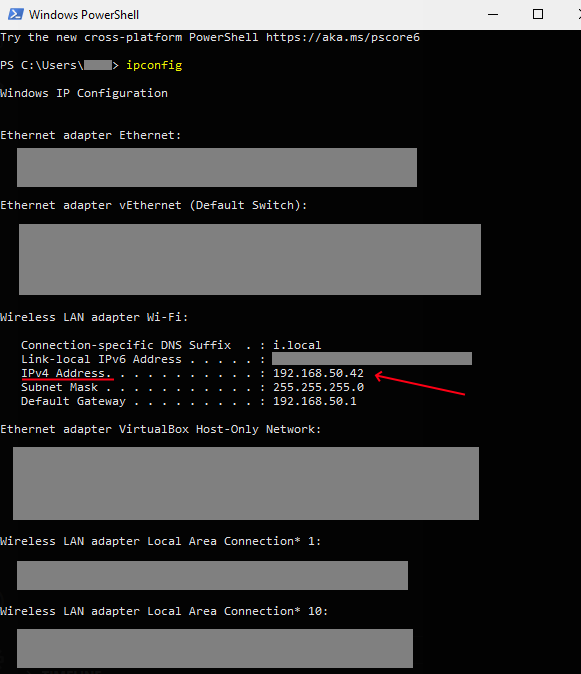

# How to get your local IP address on Windows Operating Systems

## Using the Command Prompt or PowerShell

1. Open the Start Menu and search for `cmd` or `powershell`.
2. Open the application and type `ipconfig` and press `Enter`.
3. Look for the `IPv4 Address` under the `Wireless LAN adapter Wi-Fi` or `Ethernet adapter Ethernet` section.
   - You will probably only have one of these.
     - If you are connected by Ethernet, look for `Ethernet adapter Ethernet`.
     - If you are connected by Wi-Fi, look for `Wireless LAN adapter Wi-Fi`.

